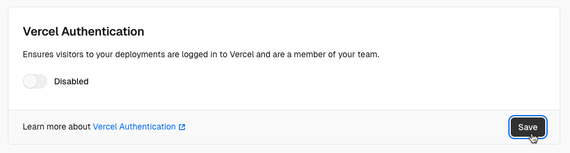
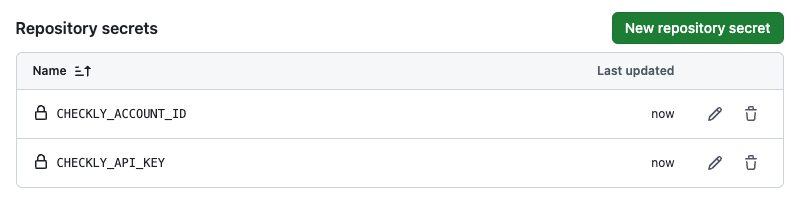

# Next.js & Checkly Starter Template

This repo showcases a simple Next.js app, hosted on Vercel, that uses Checkly to run checks before and after deployment in CI. It includes the following features:

1. A Next.js app that fetches data from the `/api/greetings` endpoint and displays it on the landing page.
2. Checkly checks in the `__checks__` directory verify if the page loads and if the API responds correctly.
3. The necessary Checkly CLI and GitHub Actions configuration to run these checks in CI.

[](https://vercel.com/new/clone?repository-url=https%3A%2F%2Fgithub.com%2Fcheckly%2Fnextjs-checkly-starter-template)

## Getting started

There are a couple ways to use this template:

- Forking the repo / clicking "Use this template" in the top right corner
- Deploying the official [Vercel template](https://vercel.com/templates/Next.js/nextjs-checkly)

Either way, get started by cloning your repo and installing dependencies:

```bash
git clone https://github.com/checkly/nextjs-checkly-starter-template.git # replace with your repo link
cd nextjs-checkly-starter-template
npm i
```

### Vercel Deployment Protection

Before running our checks, let's make sure Vercel Deployment Protection is configured to work with Checkly. If you chose to fork or use the template on GitHub, go ahead and deploy your repo to Vercel [in the dashboard](https://vercel.com/new) or with the CLI:

```bash
vercel
```

By default, Vercel Preview Deployments are protected and only accessible by logged-in members of your Vercel team. We want to be able to access these from our Checkly checks as well. We can bypass Vercel Deployment Protection by either:

- Enabling [Protection Bypass for Automation](https://vercel.com/docs/deployment-protection/methods-to-bypass-deployment-protection/protection-bypass-automation)
- Disabling Vercel Deployment Protection altogether for this example repo



If you choose to keep Deployment Protection on, ensure:

1. The **Automatically expose [System Environment Variables](https://vercel.com/docs/environment-variables/system-environment-variables)** setting (in **Project Settings > Environment Variables**) is checked; and
2. You create a `VERCEL_AUTOMATION_BYPASS_SECRET` in **Project Settings > Deployment Protection**. Our app will automatically use this for fetching from the `/api/greetings` endpoint.

Redeploy after applying any changes to your project settings in Vercel. Each deployment will alert you of anything it's missing on the landing page.

## Running checks

### Configuring testing & monitoring for production

Use the Checkly CLI to login, or [create an account](https://app.checklyhq.com/signup) if you don't already have one.

```bash
npx checkly login
```

We have a Vercel Production URL for our app, similar to `https://nextjs-checkly-starter-template-checkly.vercel.app`. Let's add this to our Checkly environment variables:

```bash
npx checkly env add "PRODUCTION_URL" "<your Vercel Production URL>"
```

Now would be a good time to also add your Vercel Deployment Protection bypass secret, if you created one earlier:

```bash
npx checkly env add --secret "VERCEL_AUTOMATION_BYPASS_SECRET" "<secret>"
```

We're ready to go! Let's run our checks in the `__checks__` directory in the Checkly cloud, and record them as a [test session](https://checklyhq.com/docs/testing/#test-sessions):

```bash
npx checkly test --record
```

Check it out in the [Checkly test sessions dashboard](https://app.checklyhq.com/test-sessions).

You can also deploy the checks as monitors:

```bash
npx checkly deploy
```

Great! We're all set up with testing & monitoring our Production Deployments, which you can check out in the [Checkly home dashboard](https://app.checklyhq.com). Let's do the same for our Vercel Preview environment.

### Running checks in CI

You can run your Checkly checks right after any Vercel Preview Deployment, and then deploy your checks as monitors on Checkly. This is a powerful strategy to make sure your never ship breaking errors to Production, while at the same time surfacing any outages in your Production Deployments.

This example uses GitHub Actions — check out the workflow in [`.github/workflows/checkly.yml`](/.github/workflows/checkly.yml) — but you can use any other CI platform. We have [example configs for Jenkins and GitLab CI in our docs](https://checklyhq.com/docs/cicd).

1. Create an API key in [**User Settings > API keys**](https://app.checklyhq.com/settings/user/api-keys).
2. Take note of your Checkly Account ID in [**Account Settings > General**](https://app.checklyhq.com/settings/account/general).
3. Save your API key and Account ID as secrets named `CHECKLY_API_KEY` and `CHECKLY_ACCOUNT_ID` in your GitHub Actions configuration.



Now, on every deployment webhook that GitHub receives from Vercel, the GitHub Actions workflow will run the checks in the `__checks__` directory.

- A Markdown-formatted report will be posted as a comment in the GitHub Actions summary.
- Preview Deployments are tested against the generated Preview Deployment URL, and recorded as test sessions in Checkly.
- Production Deployments are tested against the Production URL, and deployed as monitors in Checkly if all checks pass.

That's it for this example! If you have questions or feedback, please drop us a note in our [Slack community](https://checklyhq.com/slack).

## Further reading

- Official [Checkly integration from the Vercel Marketplace](https://vercel.com/integrations/checkly)
- Checkly docs on [integrating with Vercel](https://checklyhq.com/docs/cicd/vercel)
- Checkly docs on [integrating with GitHub Actions](https://checklyhq.com/docs/cicd/github-actions)
- Vercel docs on [running tests](https://vercel.com/guides/how-can-i-run-end-to-end-tests-after-my-vercel-preview-deployment)
